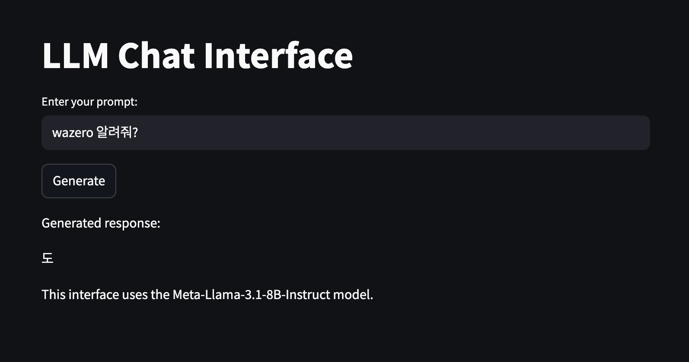
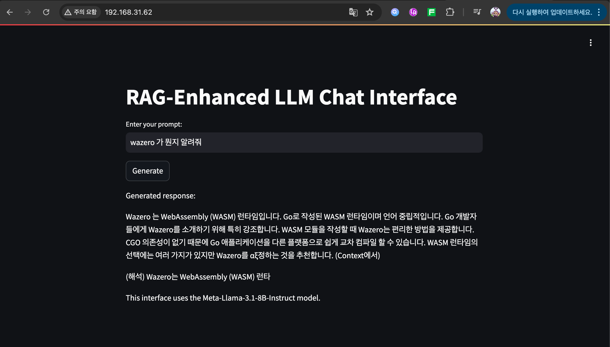

참조 링크 

https://osc-korea.atlassian.net/wiki/spaces/consulting/pages/1147470144/Rag+llm+on+k8s


# Rag 기반의 llm on k8s


## 1. 노드 사양

- OS: Ubuntu20.04
- CPU: 8
- Memory: 80GB
- GPU: X

최소 필요 사양: llama3.1 모델 기준으로 노드당 최소 64GB의 메모리가 필요합니다 (llm만 띄울 시).

## 2. 사전준비 설정

### 허깅페이스 계정 및 엑세스 토큰 생성
https://huggingface.co/settings/tokens

### Docker 설치

```bash
sudo apt-get update
sudo apt-get install ca-certificates curl
sudo install -m 0755 -d /etc/apt/keyrings
sudo curl -fsSL https://download.docker.com/linux/ubuntu/gpg -o /etc/apt/keyrings/docker.asc
sudo chmod a+r /etc/apt/keyrings/docker.asc

echo \
"deb [arch=$(dpkg --print-architecture) signed-by=/etc/apt/keyrings/docker.asc] https://download.docker.com/linux/ubuntu \
$(. /etc/os-release && echo "$VERSION_CODENAME") stable" | \
sudo tee /etc/apt/sources.list.d/docker.list > /dev/null

sudo apt-get update
sudo apt-get install docker-ce docker-ce-cli containerd.io docker-buildx-plugin docker-compose-plugin
```

### Python3 설치

```bash
apt install -y python3
```

### MetalLB 설치

```bash
kubectl apply -f https://raw.githubusercontent.com/metallb/metallb/v0.11.0/manifests/namespace.yaml
kubectl apply -f https://raw.githubusercontent.com/metallb/metallb/v0.11.0/manifests/metallb.yaml

# metallb_config.yaml 생성
cat << EOF > metallb_config.yaml
apiVersion: v1
kind: ConfigMap
metadata:
  namespace: metallb-system
  name: config
data:
  config: |
    address-pools:
    - name: default
      protocol: layer2
      addresses:
      - 192.168.31.61-192.168.31.69 # IP 대역폭
EOF

kubectl apply -f metallb_config.yaml
```


### Docker Registry 설정

```bash
docker pull registry:latest
docker run --restart always --name private-repo -d -p 5003:5000 registry

# insecure-registries 설정
cat << EOF > /etc/docker/daemon.json
{
  "exec-opts": ["native.cgroupdriver=systemd"],
  "log-driver": "json-file",
  "log-opts": {
    "max-size": "100m"
  },
  "storage-driver": "overlay2",
  "insecure-registries" :[
    "localhost:5003"
  ]
}
EOF

systemctl restart docker
```

### NFS 설치

```bash
apt install -y nfs-common
```

## 3. RAG System 및 LLM 모델 배포

### 3.1 PDF 파일 준비

PVC 생성:

```yaml
apiVersion: v1
kind: PersistentVolumeClaim
metadata:
  name: llm-model-pvc
spec:
  accessModes:
  - ReadWriteOnce
  storageClassName: longhorn
  resources:
    requests:
      storage: 100Gi # llm 모델 저장소

---
apiVersion: v1
kind: PersistentVolumeClaim
metadata:
  name: pdf-pvc
spec:
  accessModes:
  - ReadWriteMany
  storageClassName: longhorn
  resources:
    requests:
      storage: 50Gi # pdf 저장소

kubectl apply -f ./llm/pvc.yaml
```

PDF 파일 업로드를 위한 임시 pod 생성:

```yaml
apiVersion: v1
kind: Pod
metadata:
  name: pdf-upload-pod
spec:
  containers:
  - name: upload-container
    image: busybox
    command: ["/bin/sh", "-c", "tail -f /dev/null"]
    volumeMounts:
    - name: pdf-storage
      mountPath: /pdfs
  volumes:
  - name: pdf-storage
    persistentVolumeClaim:
      claimName: pdf-pvc

kubectl apply -f ./llm/upload.yaml
```

PDF 파일 복사:

```bash
kubectl cp ./tr_technology_radar_vol_29_en.pdf pdf-upload-pod:/pdfs/
```

### 3.2 허깅페이스 엑세스용 시크릿 생성

```bash
# HF_TOKEN=hf_token 실제 토큰을 넣어주세요
$ kubectl create secret generic hf-token --from-literal=HF_TOKEN=hf_token
or 
# ./llm/secret.yaml 에 실제 토큰을 설정 하세요 
$ kubectl create -f ./llm/secret.yaml
```

### 3.3 모델 다운로드용 Configmap 생성

`download_model.py` 스크립트 작성:

```python
import os
from huggingface_hub import hf_hub_download

def download_model():
    model_name = "meta-llama/Meta-Llama-3.1-8B-Instruct"
    save_directory = "/models"
    hf_token = os.environ.get("HF_TOKEN")
    if not hf_token:
        print("Error: Hugging Face token not found in environment variables.")
        return
    try:
        files_to_download = [
            "config.json",
            "generation_config.json",
            "model-00001-of-00004.safetensors",
            "model-00002-of-00004.safetensors",
            "model-00003-of-00004.safetensors",
            "model-00004-of-00004.safetensors",
            "model.safetensors.index.json",
            "special_tokens_map.json",
            "tokenizer.json",
            "tokenizer_config.json"
        ]
        for file in files_to_download:
            print(f"Downloading file: {file}")
            hf_hub_download(repo_id=model_name, filename=file, local_dir=save_directory, token=hf_token)
        print(f"Model files downloaded successfully to {save_directory}")
    except Exception as e:
        print(f"Error downloading model: {str(e)}")

if __name__ == "__main__":
    download_model()
```

Configmap 생성:

```bash
kubectl create configmap download-script-configmap --from-file=./llm/download_model.py -o yaml --dry-run=client | kubectl apply -f -
```

### 3.4 Rag-system 생성

`rag.py` 스크립트 작성 (일부 내용만 표시):

```python
import logging
import numpy as np
from flask import Flask, request, jsonify
from transformers import AutoModelForCausalLM, AutoTokenizer
from sentence_transformers import SentenceTransformer
import faiss
import os
import pickle
from PyPDF2 import PdfReader
import torch

# ... (중략) ...

app = Flask(__name__)

# ... (중략) ...

if __name__ == '__main__':
    ensure_index_exists()
    processed_files = process_pdf_directory()
    if processed_files == 0:
        logger.warning("No PDF files were processed. The index might be empty.")
    app.run(host='0.0.0.0', port=5001)
```

### 3.5 llm 과 서비스 생성

Dockerfile 작성:

```dockerfile
FROM python:3.9-slim

WORKDIR /app

RUN apt-get update && apt-get install -y \
    build-essential \
    && rm -rf /var/lib/apt/lists/*

COPY requirements_rag.txt .
RUN pip install --no-cache-dir -r requirements_rag.txt

COPY rag.py .

RUN mkdir /models

EXPOSE 5001

ARG HF_TOKEN
ENV HF_TOKEN=$HF_TOKEN
ENV MODEL_PATH=/models
CMD ["python", "rag.py"]
```

Docker 이미지 빌드 및 푸시:

```bash
# HF_TOKEN=hf_token 실제토큰을 넣어주세요
docker build --build-arg HF_TOKEN=hf_token -t localhost:5003/llm-server:v1 -f ./llm/dockerfile_rag .
docker push localhost:5003/llm-server:v1
```

Deployment 및 Service 생성:

```yaml
apiVersion: apps/v1
kind: Deployment
metadata:
  name: llm-deployment
spec:
  replicas: 1
  selector:
    matchLabels:
      app: llm-app
  template:
    metadata:
      labels:
        app: llm-app
    spec:
      initContainers:
      - name: download-model
        image: python:3.9-slim
        imagePullPolicy: IfNotPresent
        env:
        - name: HF_TOKEN
          valueFrom:
            secretKeyRef:
              name: hf-token
              key: HF_TOKEN
        command:
        - /bin/sh
        - -c
        - |
          echo "Hugging Face token: $HF_TOKEN"
          pip install requests huggingface_hub
          python /app/download_model.py
        volumeMounts:
        - name: model-storage
          mountPath: /models
        - name: download-script
          mountPath: /app
      containers:
      - name: llm-container
        image: localhost:5003/llm-server:v1
        ports:
        - containerPort: 5001
        volumeMounts:
        - name: model-storage
          mountPath: /models
        - name: pdf-storage
          mountPath: /pdfs
      volumes:
      - name: model-storage
        persistentVolumeClaim:
          claimName: llm-model-pvc
      - name: pdf-storage
        persistentVolumeClaim:
          claimName: pdf-pvc
      - name: download-script
        configMap:
          name: download-script-configmap
---
apiVersion: v1
kind: Service
metadata:
  name: llm-service
spec:
  selector:
    app: llm-app
  ports:
  - protocol: TCP
    port: 80
    targetPort: 5001
  type: LoadBalancer

kubectl apply -f ./llm/ragdeploy.yaml
```

## 4. streamlit web 배포

### 4.1 streamlit 컨테이너 생성

`streamlit_app.py` 작성:

```python
import streamlit as st
import requests
import os

LLM_SERVICE_URL = os.getenv("LLM_SERVICE_URL")

st.title("RAG-Enhanced LLM Chat Interface")

user_input = st.text_input("Enter your prompt:", "")
if st.button("Generate"):
    if user_input:
        response = requests.post(f"{LLM_SERVICE_URL}/generate",
                                 json={"prompt": user_input})
        if response.status_code == 200:
            generated_text = response.json()["generated_text"]
            st.write("Generated response:")
            st.write(generated_text)
        else:
            st.error(f"Error: {response.status_code}, {response.text}")
    else:
        st.warning("Please enter a prompt.")

st.write("This interface uses the Meta-Llama-3.1-8B-Instruct model.")
```

Dockerfile 작성:

```dockerfile
FROM python:3.9-slim

WORKDIR /app

COPY requirements.txt .
RUN pip install --no-cache-dir -r requirements.txt

COPY app.py .

CMD ["streamlit", "run", "app.py"]
```

Docker 이미지 빌드 및 푸시:

```bash
docker build -t localhost:5003/streamlit-rag-app:v1 -f ./web/Dockerfile .
docker push localhost:5003/streamlit-rag-app:v1
```

### 4.2 Sample web 과 서비스 배포

Deployment 생성:

```yaml
apiVersion: apps/v1
kind: Deployment
metadata:
  name: streamlit-rag-app
spec:
  replicas: 1
  selector:
    matchLabels:
      app: streamlit-rag-app
  template:
    metadata:
      labels:
        app: streamlit-rag-app
    spec:
      containers:
      - name: streamlit-rag-app
        image: localhost:5003/streamlit-rag-app:v1
        ports:
        - containerPort: 8501
        env:
        - name: LLM_SERVICE_URL
          value: "http://192.168.31.61:80" # llm-service 의 external IP 주소 

$ kubectl apply -f ./web/deploy.yaml
```

Service 생성:

```yaml
apiVersion: v1
kind: Service
metadata:
  name: streamlit-app
spec:
  selector:
    app: streamlit-rag-app
  ports:
  - protocol: TCP
    port: 80
    targetPort: 8501
  type: LoadBalancer

$ kubectl apply -f ./web/service.yaml
```

## 4. 테스트 결과 

Rag 적용 전 



Rag 적용 후

 